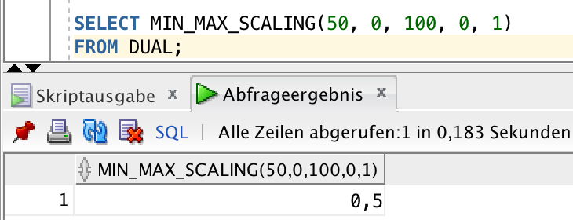

## Übung 3

#### Stefan Benz, Sebastian Horvath

##### Aufgabe 2.

```sql
CREATE OR REPLACE FUNCTION min_max_scaling (
    v   IN NUMBER,
    old_min   IN NUMBER,
    old_max   IN NUMBER,
    new_min   IN NUMBER,
    new_max   IN NUMBER
) RETURN NUMBER
    AS
BEGIN
    RETURN ((v - old_min)/(old_max - old_min))*(new_max - new_min) + new_min;
END min_max_scaling;
```



##### Aufgabe 3.

```sql
CREATE TABLE ANGESTELLTER_3
(
NAME varchar2(255),
Geburtsdatum date,
Berufsbezeichnung varchar2(255),
Monatsgehalt number,
Geschlecht varchar2(255),
Angestelltennr number,
PRIMARY KEY(Angestelltennr)
);
```


```sql
CREATE TABLE ARBEITER_3
(
Name varchar2(255),
Vorname varchar2(255),
Gebutsmonat varchar2(255),
Stundenlohn number,
PRIMARY KEY (Name, Vorname)
);
```


```sql
CREATE TABLE PERSONAL_3
(
Personalnr number,
Name varchar2(255),
Vorname varchar2(255),
"ALTER" number,
Geschlecht number,
Berufscode varchar2(255),
Jahreseinkommen number,
PRIMARY KEY(Personalnr)
);
```

```sql
CREATE TABLE BERUFSCODES_3
(
    BERUFSBEZEICHNUNG varchar2(255),
    CODE varchar2(255),
    PRIMARY KEY (CODE)
);
```

```sql
Create type gender_list_t as table of number;

Create type vorname_to_gender (
    Vorname varchar2(255),
    gender_list gender_list_t
);

CREATE TABLE VORNAME_TO_GENDER_3 of vorname_to_gender
nested table gender_list
store as gender_list_nt;
```


```sql
CREATE TABLE KEY_ZUORDNUNG_3
(
    oldKey varchar2(255),
    "SOURCE" varchar2(255),
    newkey number,
    PRIMARY KEY (oldKey)
);
```

##### Funktionen

```sql
create or replace FUNCTION EXTRACT_LAST_NAME
(
  NAME IN VARCHAR2
) RETURN VARCHAR2 AS
    nachname VARCHAR2(255);
BEGIN
    IF
        ( name LIKE '[\,]' )
    THEN
        nachname := substr(name,instrc(name,',') + 2,length(name));

    ELSE
        nachname := substr(name,instrc(name,' ') + 1,length(name));
    END IF;
    RETURN nachname;
  RETURN NULL;
END EXTRACT_LAST_NAME;
```
```sql
create or replace FUNCTION extract_first_name (
    name IN VARCHAR2
) RETURN VARCHAR2 AS
    vorname   VARCHAR2(255);
BEGIN
    IF
         name LIKE '%,%'
    THEN
        vorname := substr(name,0,instrc(name,',') - 1);
    ELSE
        vorname := substr(name,0,instrc(name,' ') - 1);
    END IF;

    RETURN vorname;
    RETURN NULL;
END extract_first_name;
```

```sql
create or replace FUNCTION CREATE_KEY_ARBEITER
(
  vorname IN VARCHAR2
, nachname IN VARCHAR2
) RETURN NUMBER AS
old_key varchar2(255);
new_key number;
query_key_in_pers number;
BEGIN
  old_key := CONCAT(vorname, nachname);
  Select ORA_HASH(old_key) into new_key from dual;

  Select count(*)
  into query_key_in_pers
  from PERSONAL_3 P3 where P3.PERSONALNR = new_key;

  IF query_key_in_pers = 0 THEN
    Insert into KEY_ZUORDNUNG_3 Values(old_key,'Arbeiter',new_key);
  END IF;

  RETURN new_key;
END CREATE_KEY_ARBEITER;
```

```sql
create or replace FUNCTION CREATE_KEY_ANGESTELLTER
(
  old_key IN NUMBER
) RETURN NUMBER AS
new_key number;
query_key_in_pers number;
BEGIN
  Select ORA_HASH(old_key) into new_key from dual;

  Select count(*) into query_key_in_pers
  from PERSONAL_3 P3 where P3.PERSONALNR = new_key;

  IF query_key_in_pers = 0 THEN
    Insert into KEY_ZUORDNUNG_3
    Values(TO_CHAR(old_key),'Angestellter',new_key);
  END IF;

  RETURN new_key;
END CREATE_KEY_ANGESTELLTER;
```
```sql
create or replace FUNCTION CONVERT_TO_BERUFSCODE
(
  Bezeichnung IN STRING
) RETURN NUMBER AS
code_result number;

BEGIN
    SELECT BERUFSCODES_3.CODE
    INTO code_result
    FROM BERUFSCODES_3
    WHERE BERUFSCODES_3.BERUFSBEZEICHNUNG = UPPER(Bezeichnung);
  RETURN code_result;
END CONVERT_TO_BERUFSCODE;
```
Diese Funktion sucht in der VORNAME_TO_GENDER_3 nach dem
vorhandenen Vornamen, um das Geschlecht zu ermitteln:
```sql
create or replace FUNCTION CONVERT_GENDER_ARBEITER
(
  Vorname IN VARCHAR2
) RETURN NUMBER AS
name_to_lower varchar2(255);
gender_val number;
query_result gender_list_t;
query_count number;
BEGIN
  gender_val:= 0;
  name_to_lower := LOWER(Vorname);
  Select count(*) Into query_count
  From VORNAME_TO_GENDER_3 vtg
  where LOWER(vtg.VORNAME) = name_to_lower;
  IF query_count > 0 THEN
    Select vtg.GENDER_LIST
    Into query_result
    From VORNAME_TO_GENDER_3 vtg
    where LOWER(vtg.VORNAME) = name_to_lower;
    IF query_result.count = 1 THEN
        gender_val := query_result.first;
    END IF;  
  END IF;
  RETURN gender_val;
END CONVERT_GENDER_ARBEITER;
```
Konvertiert den Geschlechts String zu erforderlichen Zahl

```sql
create or replace FUNCTION CONVERT_GENDER_ANGESTELLTER
(
  Geschlecht IN VARCHAR2
) RETURN NUMBER AS
new_gender_val number;
current_gender_val varchar2(255);
BEGIN
  new_gender_val := 0;
  current_gender_val := LOWER(Geschlecht);
  IF current_gender_val = 'männlich' THEN
    new_gender_val := 2;
  ELSIF current_gender_val = 'weiblich' THEN
    new_gender_val := 1;
  END IF;  
  RETURN new_gender_val;
END CONVERT_GENDER_ANGESTELLTER;
```

Berechnet den Jahreslohn aus dem Monatslohn:
```sql
create or replace FUNCTION CALC_YEAR_INCOME
(
  MONTH_INCOME IN NUMBER
) RETURN NUMBER AS
BEGIN
  RETURN 12 * MONTH_INCOME;
END CALC_YEAR_INCOME;
```
Berechnet den Monatslohn aus dem Stundenlohn:
```sql
create or replace FUNCTION CALC_MONTH_INCOME
(
  HOUR_INCOME IN NUMBER
) RETURN NUMBER AS
BEGIN
  RETURN 40 * 4 * HOUR_INCOME;
END CALC_MONTH_INCOME;
```
Berechnet das Alter vom Arbeiter.
Wenn der aktuelle Monat mit dem geburtsmonat übereinstimmt,
zählt es noch nicht als ein Jahr älter.
```sql
create or replace FUNCTION CALC_AGE_WORKER
(
  BIRTHMONTH IN VARCHAR2
) RETURN NUMBER AS
date_value date;
current_date date;
age number;
BEGIN
    date_value := TO_DATE(BIRTHMONTH, 'MM.YY');
    current_date := SYSDATE;
    age := EXTRACT(YEAR FROM current_date) - EXTRACT(YEAR
      FROM date_value);
    IF EXTRACT(MONTH FROM date_value) >= EXTRACT(MONTH
      FROM current_date) THEN
        age := age - 1;
    END IF;
    return age;
  RETURN age;
END CALC_AGE_WORKER;
```
Berechnet das Alter vom Angestellten:
```sql
create or replace FUNCTION CALC_AGE_ANGESTELLTER
(
  BIRTHDAY IN DATE
) RETURN NUMBER AS
year_value number;
month_value number;
day_value number;
current_date date;
age number;
BEGIN
    year_value := EXTRACT(YEAR FROM BIRTHDAY);
    month_value := EXTRACT(MONTH FROM BIRTHDAY);
    day_value := EXTRACT(DAY FROM BIRTHDAY);
    current_date := SYSDATE;
    age := EXTRACT(YEAR FROM current_date) - year_value;
    IF month_value > EXTRACT(MONTH FROM current_date) THEN
        age := age - 1;
    ELSIF month_value = EXTRACT(MONTH FROM current_date)  THEN
        IF day_value > EXTRACT(DAY FROM current_date) THEN
         age := age - 1;
        END IF;
    END IF;
    return age;
END CALC_AGE_ANGESTELLTER;
```
